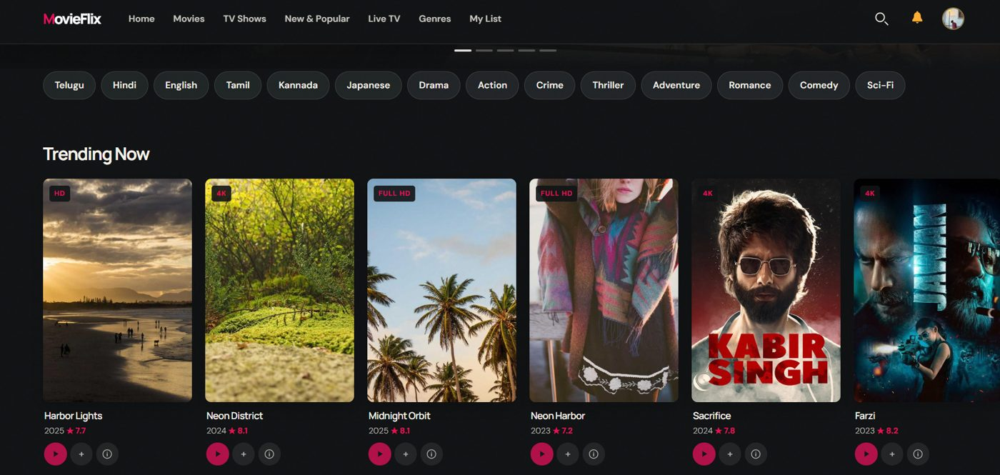
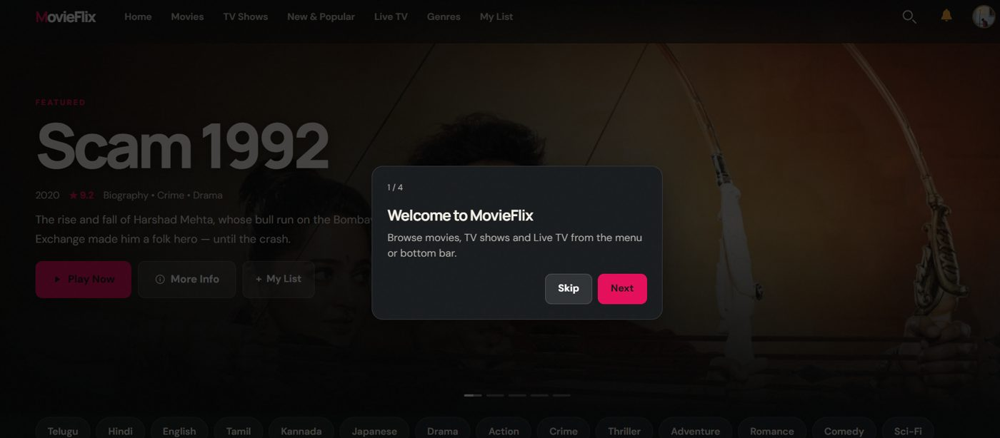
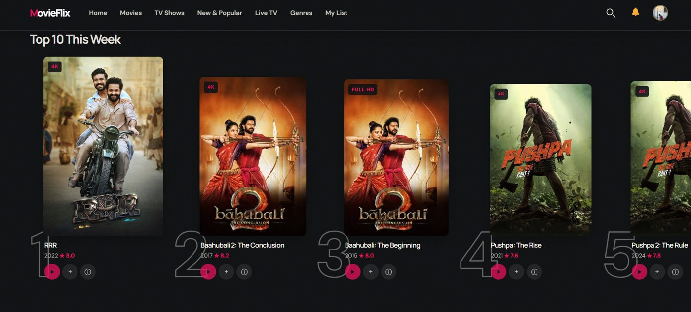
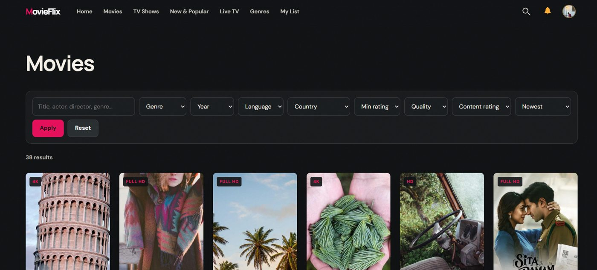
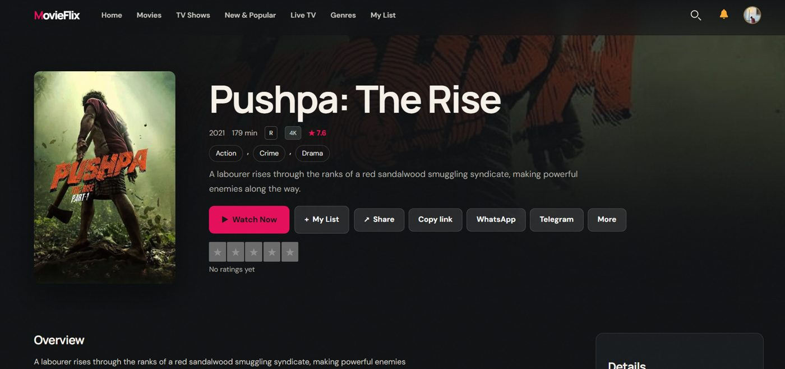
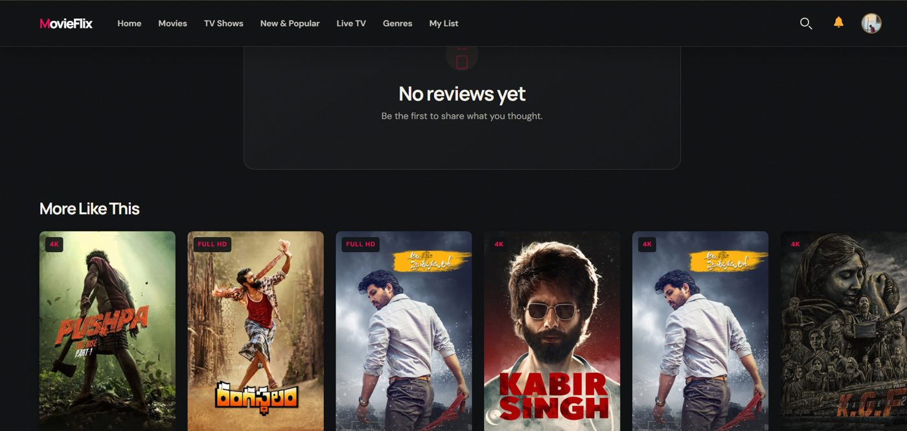
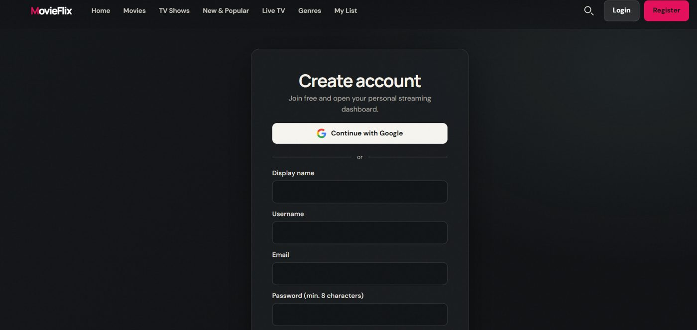

# MovieFlix

A Netflix-style movie and TV streaming website built on WordPress. A custom plugin runs the data and a custom theme draws the screens. Both were designed with AI tools as my second WordPress project.

[**Live site**](https://movieflix.freehosting.dev/) | [**Project guide**](https://ajay995182.github.io/movieflix/) | [**Downloads**](releases/)



## How it is built

| Part | Folder | Version | Job |
|---|---|---|---|
| MovieFlix Core (plugin) | `wp-content/plugins/movieflix-core` | 1.5.0 | Data and rules: content types, filters, My List, progress, ratings, activity, Google login, admin tools |
| MovieFlix (theme) | `wp-content/themes/movieflix` | 2.0.4 | Look and pages: home, browse, detail, watch, Live TV, auth pages, mobile menu, PWA |

The plugin never draws the interface and the theme never stores data. They talk through PHP helpers, post meta and AJAX. If the plugin is off, the theme shows a message asking you to activate MovieFlix Core.

Custom tables: `watch_history`, `watchlist`, `ratings`, `views`, `activity`.

## Features

**Browse and find**: hero banner and rows (Trending, Popular, New, recommendations); Movies, TV Shows and New & Popular grids; live search suggestions; genre pages, language chips, similar titles.

**Watch**: watch page at `/watch/title-slug/`; MP4 and HLS (`.m3u8`); subtitle and audio pickers; skip intro and next-episode overlay; automatic progress for Continue Watching.

**Accounts and profiles**: register, login, logout, password reset; Continue with Google; My List without page reload; star ratings and reviews; multiple profiles, Kids profile, optional parental PIN, members-only titles.

**Content and Live TV**: movies, series with seasons and episodes, people pages; filters for genre, language, country, age rating, quality and year; Live TV channel grid with favourites and a live player.

**Mobile and web app**: bottom navigation, two posters per row on phones, full-screen search, PWA install banner, service worker, notification bell.

**Admin tools**: MovieFlix Settings (colours, force login, PWA, ads, Google, channels, profiles); edit screens for movies, series, episodes and channels; chunked video upload; demo import and remove; CSV, TMDB and bulk-episode import; activity log and analytics.

## Screenshots

| | |
|---|---|
|  |  |
|  |  |
|  |  |

## Install

Requires WordPress 6.0+ and PHP 7.4+. Do the steps in this order.

1. **Plugin**: Plugins > Add New > Upload Plugin > `releases/movieflix-core-1.5.0.zip` > Install > Activate.
2. **Theme**: Appearance > Themes > Add New > Upload Theme > `releases/movieflix-theme-2.0.4.zip` > Install > Activate.
3. **Permalinks**: Settings > Permalinks > Post name > Save. Required for `/watch/` links.
4. **Demo content**: MovieFlix in the admin menu > Import demo content (test data only).
5. **Settings**: MovieFlix > Settings. Optionally add a Google Client ID and Secret and turn on profiles, Kids mode and force login.

Or copy the two folders under `wp-content/` straight into your WordPress install.

## Test checklist

The project guide ([docs/index.html](https://ajay995182.github.io/movieflix/)) has a 35-point checklist for login, My List, player, ratings, Live TV and admin. Run it once on a laptop and once on a phone.

## Demo data

This is a test project, not a real streaming service.

- 38 movies, 8 series, 30 people, 12 channels, using real Indian film titles so the layout looks like a catalog.
- Poster and backdrop images load from TMDB. The plugin also ships 13 SVG placeholder posters.
- Every title plays the same open sample videos (Blender open movies and a public Mux HLS stream). No copyrighted film is included.
- Remove the demo (Remove demo in admin) and use only video and artwork you have the rights to before real use.
- Continue with Google needs a Client ID and Secret plus Google Cloud Console setup. HTTPS is needed for Google login, notifications and PWA install.

## Repo layout

```
movieflix/
  wp-content/plugins/movieflix-core/   plugin source
  wp-content/themes/movieflix/         theme source
  releases/                            installable zips
  docs/                                project guide (open index.html)
  screenshots/                         images used in this README
```

## Credits and licence

Designed by Ajay with AI tools. Licensed under GPL-2.0-or-later (see `LICENSE`). hls.js is loaded from jsDelivr. This product uses the TMDB API but is not endorsed or certified by TMDB.
